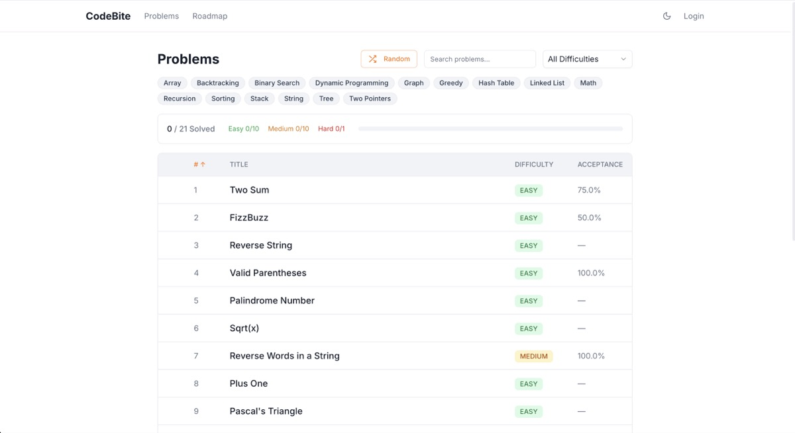
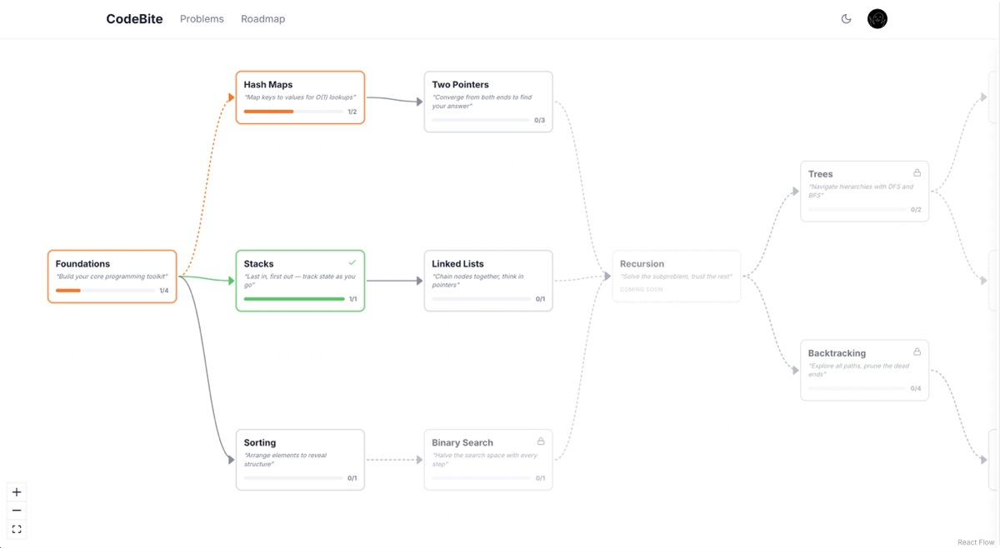
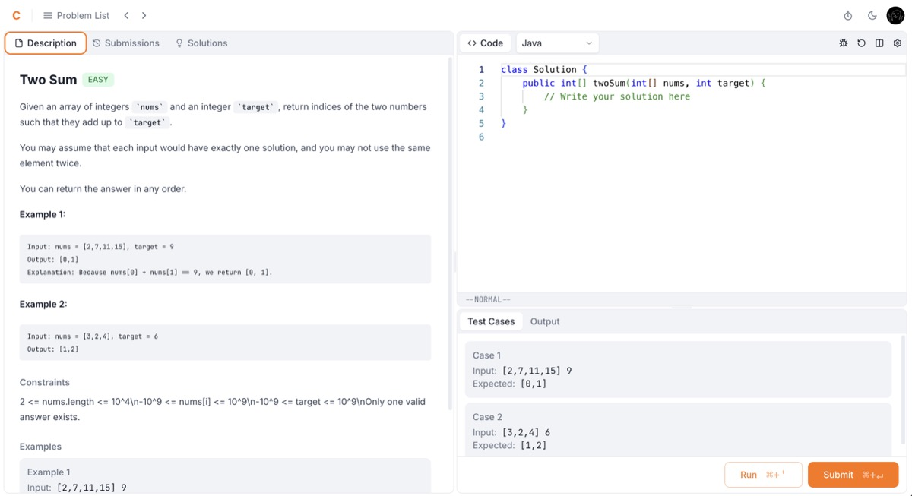

# CodeBite

한국 개발자를 위한 알고리즘 코딩 연습 플랫폼

## 소개

해외에는 Grind75, NeetCode 150 등 체계적인 알고리즘 학습 로드맵이 있지만, 한국 개발자들은 이런 자료의 존재를 모르거나 LeetCode의 영어가 진입 장벽으로 작용합니다.

CodeBite는 **선행 토픽 순서에 따른 학습 로드맵**을 제공하고, 한국어 환경에서 바로 코드를 작성하고 실행할 수 있는 플랫폼입니다.

## 스크린샷

### 문제 목록

### 학습 로드맵

### 코드 에디터

## 주요 기능

- **코드 실행 (Run)** — 샘플 테스트 케이스로 즉시 실행 및 결과 확인
- **코드 제출 (Submit)** — Kafka 기반 비동기 채점, 전체 테스트 케이스 실행
- **OAuth 로그인** — Google / GitHub 소셜 로그인
- **Monaco 코드 에디터** — VS Code 동일 엔진, Java / Python / JavaScript / C++ 지원
- **어드민 대시보드** — 제출 통계, 문제별 정답률, 유저 관리
- **모니터링** — Prometheus 메트릭 + Grafana 대시보드 + Loki 로그 수집

## 기술 스택

**Backend** — Java 17, Spring Boot 3.2, Spring Security (JWT + OAuth2), Spring Data JPA, Spring Kafka, PostgreSQL 15, Redis 7, Flyway

**Frontend** — React 19, TypeScript, Vite, Tailwind CSS v4, Monaco Editor, Recharts

**Infrastructure** — Docker Compose, Nginx (로드밸런서), Apache Kafka, Judge0 CE (샌드박스 코드 실행), Prometheus + Grafana, Loki + Promtail, GitHub Actions (CI/CD)
