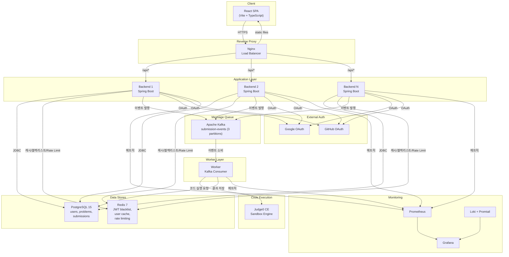

# CodeBite

한국 개발자를 위한 알고리즘 코딩 연습 플랫폼

---

## 📝 1. 프로젝트 소개

해외에는 Grind75, NeetCode 150 등 체계적인 알고리즘 학습 로드맵이 있지만, 한국 개발자들은 이런 자료의 존재를 모르거나 LeetCode의 영어가 진입 장벽으로 작용합니다.

CodeBite는 **선행 토픽 순서에 따른 학습 로드맵**을 제공하고, 한국어 환경에서 바로 코드를 작성하고 실행할 수 있는 플랫폼입니다.

- **코드 실행 (Run)** — 샘플 테스트 케이스로 즉시 실행 및 결과 확인
- **코드 제출 (Submit)** — Kafka 기반 비동기 채점, 전체 테스트 케이스 실행
- **OAuth 로그인** — Google / GitHub 소셜 로그인
- **Monaco 코드 에디터** — VS Code 동일 엔진, Java / Python / JavaScript / C++ 지원
- **어드민 대시보드** — 제출 통계, 문제별 정답률, 유저 관리
- **모니터링** — Prometheus 메트릭 + Grafana 대시보드 + Loki 로그 수집

### 문제 목록


### 학습 로드맵


### 코드 에디터


---

## 🔧 2. 기술 스택

| 카테고리 | 사용 기술 |
|---------|----------|
| Backend | Java 17, Spring Boot 3.2, Spring Security, Spring Data JPA, Spring Kafka |
| Frontend | React 19, TypeScript, Vite, Tailwind CSS v4, Monaco Editor, Recharts |
| Database | PostgreSQL 15, Redis 7, Flyway |
| Infrastructure | Docker Compose, Nginx, Apache Kafka, Judge0 CE |
| Monitoring | Prometheus, Grafana, Loki, Promtail |
| CI/CD | GitHub Actions, SSH Deploy |

---

## ✔️ 3. 기술적 의사결정

| 요구사항 | 선택 기술 | 기술 선택 이유 |
|---------|----------|--------------|
| 비동기 채점 | Kafka vs 동기 처리 | 코드 채점은 Judge0 호출 + 폴링으로 수 초~수십 초 소요됩니다. 동기 처리 시 API 서버 스레드가 블로킹되어 동시 요청 처리가 제한됩니다. Kafka를 통해 API 서버와 Worker를 분리하여 독립적 스케일링이 가능하고, 메시지 유실 없이 안정적으로 처리할 수 있어 선택했습니다. |
| 코드 실행 엔진 | Judge0 CE vs 자체 구현 | 샌드박스 코드 실행 환경을 직접 구현하면 보안(컨테이너 격리, 리소스 제한)과 40+ 언어 지원의 복잡도가 매우 높습니다. Judge0 CE는 오픈소스로 Docker 기반 샌드박스를 제공하고, REST API로 간단히 통합할 수 있어 선택했습니다. |
| 인증 방식 | 수동 OAuth + JWT vs Spring Security OAuth2 Client | Spring Security OAuth2 Client는 세션 기반으로 동작하여 수평 확장 시 세션 공유(Sticky Session 또는 Redis Session)가 필요합니다. Stateless JWT 기반으로 수동 구현하면 서버 간 상태 공유 없이 로드밸런싱이 가능하고, OAuth 흐름의 각 단계를 직접 제어할 수 있어 선택했습니다. |
| Rate Limiting | Redis SET NX EX vs Bucket4j | Bucket4j는 JVM 내 메모리 기반이라 다중 인스턴스 환경에서 서버별 독립적으로 카운팅됩니다. Redis `SET NX EX` 명령어는 단일 명령으로 원자적 check-and-set이 가능하고, 이미 JWT 블랙리스트와 캐싱에 사용 중인 Redis를 활용하여 추가 의존성 없이 분산 Rate Limiting을 구현할 수 있어 선택했습니다. |
| 데이터베이스 | PostgreSQL vs MySQL | PostgreSQL은 복잡한 쿼리 최적화, JSON 지원, 표준 SQL 준수도가 높습니다. 또한 향후 Full-text Search, Partial Index 등 고급 기능 활용 가능성을 고려하여 선택했습니다. |
| 모니터링 | Prometheus + Grafana vs ELK | Spring Boot Actuator가 Prometheus 포맷 메트릭을 네이티브로 지원하여 별도 설정 없이 바로 연동됩니다. Grafana 대시보드 import로 빠르게 시각화가 가능하고, 로그는 경량화된 Loki + Promtail 조합으로 수집하여 ELK 대비 리소스 사용량이 적어 미니 PC 배포 환경에 적합합니다. |
| CI/CD | GitHub Actions vs Jenkins | Jenkins는 별도 CI 서버 구축과 관리가 필요합니다. GitHub Actions는 GitHub과 네이티브 통합되어 설정이 간단하고, 무료 러너를 제공하여 별도 인프라 없이 CI/CD를 구성할 수 있어 선택했습니다. |

---

## 🛠️ 4. 서비스 아키텍처



---

## 🖥️ 5. 주요 기능

### 코드 제출 파이프라인 (Kafka + Judge0)

코드 제출은 **비동기 이벤트 기반 아키텍처**로 처리됩니다.

```
사용자 코드 제출
  → Backend: 제출 저장 (PENDING) + Kafka 이벤트 발행
  → Kafka: submission-events 토픽
  → Worker: 이벤트 소비 + Judge0 API 호출
  → Judge0: 샌드박스 환경에서 코드 실행
  → Worker: 결과 DB 저장
  → Frontend: 2초 간격 폴링으로 결과 확인
```

- **Kafka 기반 디커플링** — API 서버와 채점 워커를 분리하여 독립적 스케일링 가능
- **멱등성 보장** — Worker가 이벤트를 중복 수신해도 `status == PENDING` 체크로 이중 처리 방지
- **드라이버 코드 템플릿** — 문제별/언어별 드라이버 파일로 `{USER_CODE}` 플레이스홀더에 사용자 코드를 삽입
- **Early Exit** — 테스트 케이스 중 하나라도 실패하면 나머지를 실행하지 않고 즉시 종료

### 실시간 코드 실행 (Run)

- Submit과 달리 **동기 처리** — Kafka를 거치지 않고 Judge0를 직접 호출하여 즉시 결과 반환
- **인증 불요** — 로그인하지 않은 사용자도 코드 실행 가능
- **DB 미저장** — 연습용이므로 데이터를 영구 저장하지 않음

### Redis Rate Limiting

| 엔드포인트 | 식별자 | 쿨다운 |
|-----------|--------|--------|
| `POST /api/problems/{slug}/submit` | User ID | 10초 |
| `POST /api/problems/{slug}/run` | Client IP | 5초 |

- Redis `SET NX EX` 명령어로 원자적 check-and-set — Race condition 없이 단일 명령으로 처리
- Redis 장애 시 Rate Limiter를 우회하여 서비스 가용성 우선 (Fail-open)

### OAuth 인증 시스템

- CSRF 방어를 위한 **서명된 JWT State 토큰**
- `jti` 기반 **Redis 토큰 블랙리스트** — 로그아웃 시 남은 TTL만큼 보관
- `@ConditionalOnBean` 활용 **Graceful Degradation** — Redis 장애 시에도 서비스 정상 동작
- 유저 프로필 **Redis 캐싱** (TTL 5분, cache-aside 패턴)

### 모니터링

- **Prometheus + Grafana** — Backend/Worker 메트릭 15초 간격 수집, 커스텀 비즈니스 메트릭 (제출 수, 채점 완료, 처리 시간)
- **Loki + Promtail** — Docker 컨테이너 로그 중앙 집중 수집, Grafana에서 메트릭과 로그 통합 조회

---

## ❌ 6. 트러블 슈팅

### Judge0 API 연동 실패 (HTTP 422)

**문제 확인**
- 코드 제출 시 Judge0 API가 422 에러를 반환하고, 응답의 알 수 없는 필드로 역직렬화가 실패하여 제출이 PENDING 상태에서 멈춤

**원인**
- RestTemplate이 `Transfer-Encoding: chunked`를 사용했는데, Judge0 API는 명시적 `Content-Length` 헤더만 허용
- Jackson이 Judge0 응답의 미지 필드에 대해 엄격 모드로 동작하여 역직렬화 실패

**해결**
- 요청을 byte[]로 직렬화 후 `Content-Length` 헤더를 명시적으로 설정
- ObjectMapper에 `FAIL_ON_UNKNOWN_PROPERTIES = false` 적용

---

### Kafka 컨테이너 무한 재시작 (프로덕션)

**문제 확인**
- 프로덕션 환경에서 Kafka 컨테이너가 크래시 후 무한 재시작, 코드 채점 파이프라인 전체 중단

**원인**
- `apache/kafka:3.7.0` 이미지는 `appuser`(uid 1000)로 실행되지만, 볼륨 마운트 디렉토리가 root 소유
- 권한 불일치로 로그 쓰기 실패 → 즉시 크래시

**해결**
- Kafka 로그는 임시 데이터(제출은 이미 PostgreSQL에 저장됨)이므로 불필요한 볼륨 마운트를 제거하여 해결

---

### Docker Healthcheck 401 Unauthorized

**문제 확인**
- 모든 Backend 레플리카가 unhealthy로 표시되었지만 실제 서비스는 정상 동작

**원인**
- Healthcheck에서 `wget --spider` 사용 (HEAD 요청 전송)
- SecurityConfig에서 `/api/health`에 GET만 허용 → HEAD 요청은 401 반환

**해결**
- Healthcheck를 `wget -O /dev/null` (GET 요청)으로 변경
- SecurityConfig에 HEAD 메서드 허용 추가

---

### Worker 메트릭 수집 불가

**문제 확인**
- Prometheus가 Worker 서비스의 메트릭을 스크래핑하지 못해 모니터링 불가

**원인**
- Worker의 `web-application-type: none` 설정이 management 서버까지 비활성화
- `management.server.port` 설정이 있어도 웹 서버 자체가 생성되지 않음

**해결**
- `web-application-type`을 `servlet`으로 변경
- Actuator 엔드포인트를 8081 포트에서 단독 운영 (비즈니스 웹 핸들러 없음)

---

### 로그인 페이지 강제 리다이렉트

**문제 확인**
- 사이트 첫 방문 시 또는 로그아웃 시 `/login`으로 강제 리다이렉트

**원인**
- Axios 401 인터셉터에서 `window.location.href = "/login"`으로 하드 리다이렉트
- AuthContext와 ProtectedRoute가 이미 인증 상태를 관리하고 있었으나, 인터셉터가 이를 무시하고 먼저 개입

**해결**
- 인터셉터에서 `window.location.href` 제거, `localStorage.removeItem("token")`만 유지
- 인증 상태 관리를 AuthContext에 일임
