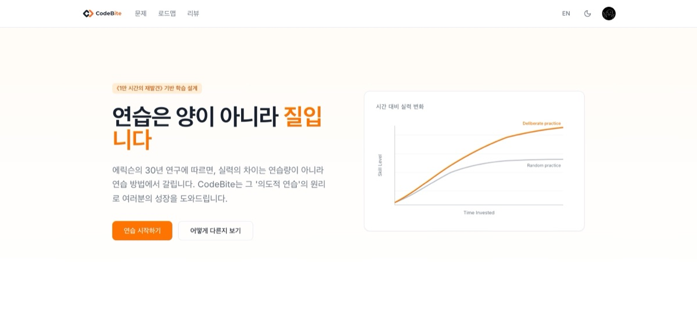
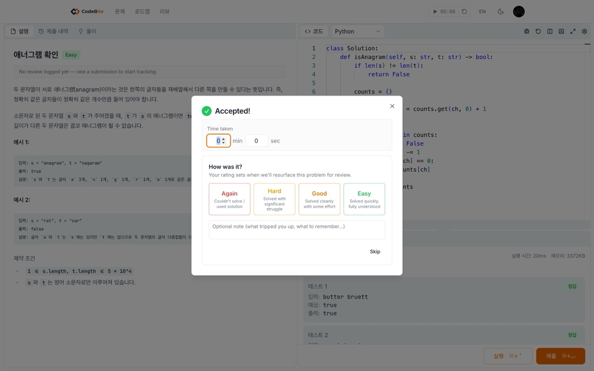
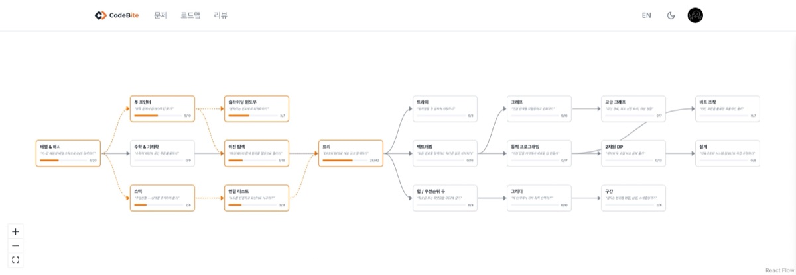
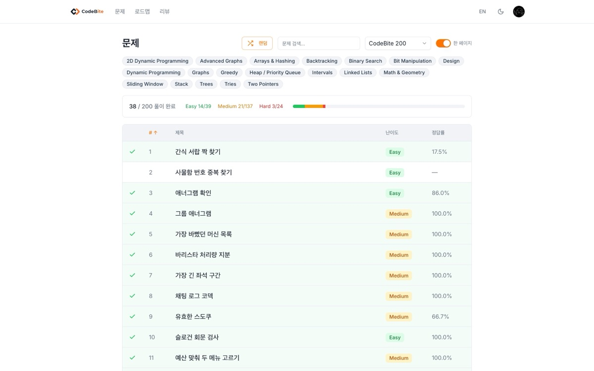
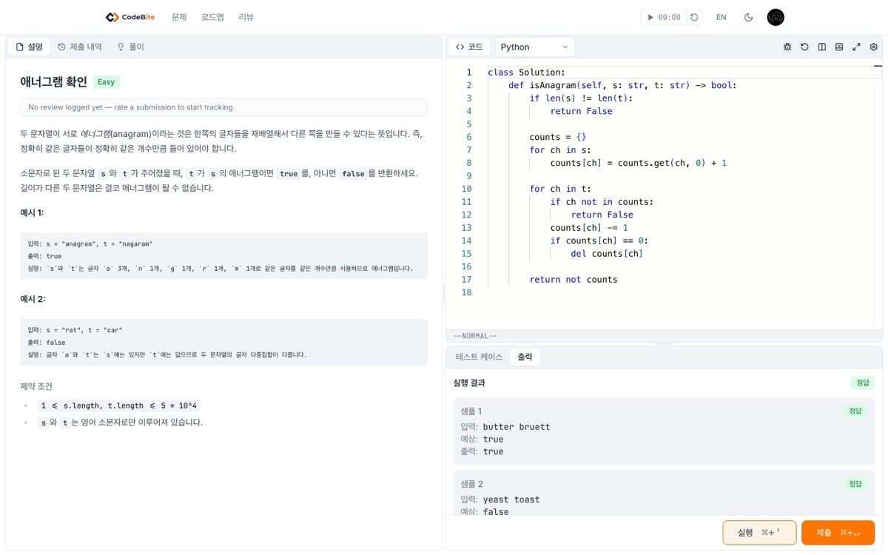
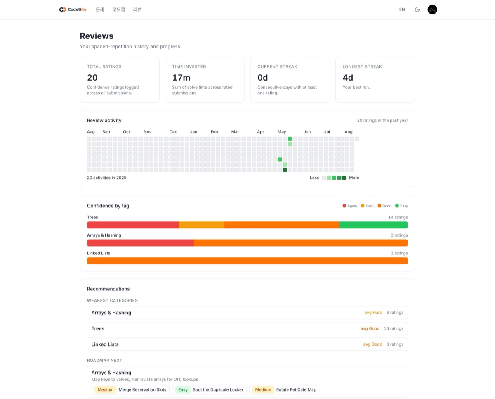
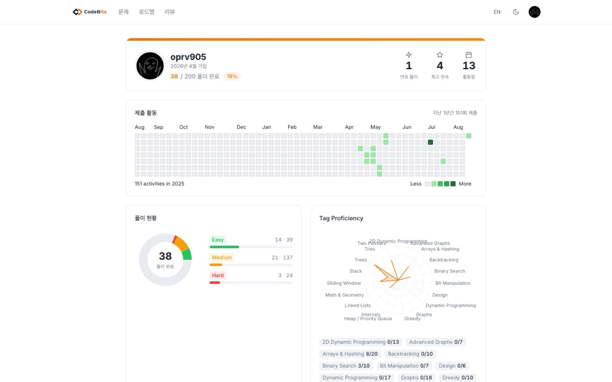
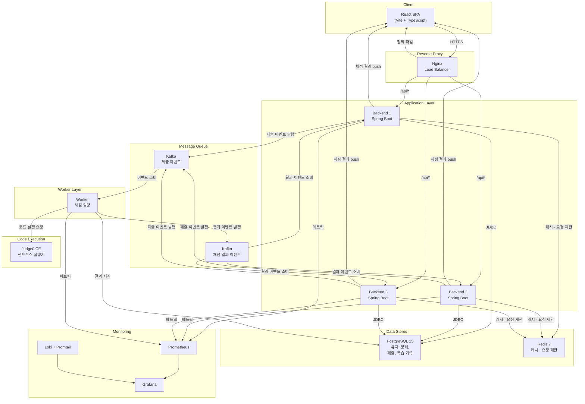

# CodeBite

**의도적 연습(deliberate practice)을 위한 알고리즘 학습 플랫폼**

🔗 **[code-bite.com](https://code-bite.com)** — 집에 있는 미니 PC 한 대에서 실제로 운영 중입니다.



---

## 1. 왜 만들었나 — 의도적 연습을 소프트웨어로

LeetCode 같은 사이트를 오래 써봤지만, **"아무 문제나 많이 푸는 것"만으로는 실력이 잘 늘지 않는다**는 아쉬움이 계속 남았습니다. 어제 푼 문제를 오늘 다시 풀면 막히고, 다음에 무엇을 풀어야 할지는 늘 감으로 골랐습니다.

안데르스 에릭슨의 「1만 시간의 재발견」은 그 이유를 이렇게 설명합니다. 실력의 차이는 연습량이 아니라 **연습 방법**에서 갈리며, 효과적인 연습에는 세 가지 조건이 필요합니다.

- **수준에 맞는 문제** — 너무 쉽거나 너무 어려우면 배우는 게 없습니다
- **즉각적인 피드백** — 틀렸다는 걸 빨리 알아야 고칠 수 있습니다
- **간격을 둔 반복** — 잊을 만할 때 다시 꺼내야 오래 남습니다

CodeBite는 이 세 조건을 각각 학습 로드맵, 코드 실행·채점, 복습 시스템으로 옮겨본 결과물입니다.

여기에 한 가지 문제가 더 있었습니다. Grind75, NeetCode 150 같은 좋은 커리큘럼이 해외에는 이미 있지만, 한국 개발자에게는 **존재 자체가 잘 알려져 있지 않거나 영어가 진입 장벽**이 됩니다. 그래서 문제 설명을 한국어로 제공하고, 로드맵도 한국어 토픽 이름으로 다시 그렸습니다.

그리고 개인적으로는, **백엔드의 전 사이클(비동기 처리 · 외부 서비스 연동 · 관측 · 배포)을 처음부터 끝까지 혼자 설계하고 운영해보는 학습의 기회**로 삼고자 했습니다.

### 간격 반복이 실제로 도는 방식

정답을 맞히면 바로 이 화면이 뜹니다. 여기서 누른 버튼 하나가 이 문제를 **언제 다시 만날지**를 결정합니다.



Anki 같은 암기 앱이 쓰는 방식을 그대로 가져왔습니다. 쉽게 푼 문제일수록 다음 복습까지의 간격이 점점 길어지고, 막힌 문제는 간격이 짧아져 금방 다시 돌아옵니다.

- **Again** (못 풀었음) — 내일 다시
- **Hard** (겨우 풀었음) — 간격을 조금만 늘림
- **Good** (무난했음) — 간격을 평소만큼 늘림
- **Easy** (쉬웠음) — 간격을 크게 늘림

결과적으로 이미 익숙한 문제는 자연스럽게 시야에서 멀어지고, 약한 문제에 연습 시간이 몰리게 됩니다.

---

## 2. 무엇을 하는 서비스인가

### 학습 로드맵 — 무엇을 먼저 풀어야 하는가

배열을 모르면 슬라이딩 윈도우를 풀 수 없고, 트리를 이해하지 못하면 그래프에 접근할 수 없습니다. 19개 토픽을 선행 관계로 연결해, 지금 열려 있는 토픽과 아직 이른 토픽을 한눈에 보여줍니다. 토픽마다 내 진행률이 함께 표시됩니다.



### 문제 목록 — 200문제, 3단계 큐레이션

전체 200문제를 CB50 / CB100 / CB200 세 단계로 큐레이션했습니다. 시간이 없으면 50문제만, 여유가 있으면 200문제 전체를 볼 수 있습니다. 태그 필터, 검색, 정답률, 내가 푼 문제 표시를 제공하고, 문제 본문은 서버에서 한국어로 번역해 내려줍니다.



### 코드 워크스페이스

설명 · 에디터 · 테스트 결과 3분할 화면입니다. 패널은 드래그로 크기를 조절하거나 접을 수 있습니다.



- **Monaco 에디터** — VS Code와 같은 엔진, Java / Python / JavaScript / C++ / C 지원
- **Vim · Emacs 키바인딩**, 폰트 크기 · 탭 크기 · 자동완성 설정
- **커스텀 테스트 케이스** — 직접 입력한 케이스를 추가해서 실행
- **문제 설명 속 다이어그램** — 트리 · 그래프 · 그리드 · 연결 리스트를 그림으로 그려서 보여줍니다
- **풀이 타이머**, 작성 중인 코드는 언어별로 자동 저장
- 단축키 — `Cmd/Ctrl + '` 실행, `Cmd/Ctrl + Enter` 제출

### 복습 대시보드

지금까지의 평가 기록, 연속 학습일, 태그별 이해도 분포, 그리고 **가장 약한 태그와 로드맵상 다음에 풀 문제 추천**까지 한 화면에 모았습니다.



### 프로필

제출 활동 히트맵, 난이도별 풀이 현황, 태그별 숙련도, 복습 예정 문제 목록.



그 외 — Google · GitHub 계정 로그인, 한국어 · 영어 전환, 다크 모드, 문제 · 테스트케이스 · 유저를 관리하는 어드민 대시보드.

---

## 3. 어떻게 동작하나 — 비동기 채점 파이프라인

사용자가 코드를 제출하면, 백엔드는 **채점이 끝날 때까지 기다리지 않습니다.** 제출을 "채점 대기" 상태로 DB에 기록하고 Kafka에 메시지 하나를 던진 뒤 곧바로 응답합니다. 별도 프로세스인 워커가 그 메시지를 받아 Judge0(샌드박스 코드 실행기)에 채점을 맡기고, 결과를 DB에 저장합니다. 결과는 서버가 브라우저로 밀어주는 방식(SSE)으로 전달됩니다.

```
사용자 코드 제출
  → Backend : "채점 대기"로 저장 + Kafka에 메시지 발행 → 즉시 응답
  → Worker  : 메시지를 받아 Judge0로 채점 → 결과 DB 저장
  → Backend : 채점 완료를 전달받아 브라우저로 결과 push
  → Frontend: 결과 표시 (연결이 끊기면 짧은 주기 폴링으로 폴백)
```

채점을 API 서버에서 떼어낸 이유는 단순합니다. 채점은 수 초에서 수십 초가 걸리는 작업이라, 동기로 처리하면 그동안 API 서버 스레드가 묶여버립니다. 분리해두면 채점이 밀릴 때 워커만 따로 늘릴 수 있고, 워커가 죽어도 메시지는 Kafka에 남아 있어 되살아난 뒤 이어서 처리합니다.

- **같은 제출을 두 번 채점하지 않기** — 워커가 같은 메시지를 중복으로 받아도, 이미 채점이 끝난 제출이면 건너뜁니다
- **결과는 DB에 확실히 저장된 뒤에만 알림** — 채점 도중 문제가 생겨 저장이 취소되면 그 제출은 다시 채점 대기로 돌아갑니다. 그래서 "채점 끝났다"는 알림은 저장이 완전히 확정된 뒤에만 보냅니다. 알림 전송에 실패하더라도 결과는 이미 DB에 있으므로, 브라우저가 폴링으로 가져갑니다
- **어느 서버에 연결돼 있어도 결과가 도착** — 백엔드가 3대로 돌기 때문에, 사용자의 연결이 붙은 서버와 채점 완료 알림을 받은 서버가 다를 수 있습니다. 그래서 알림은 특정 서버 하나가 아니라 **3대 모두에게** 전달되도록 했습니다
- **드라이버 코드** — 문제별·언어별로 미리 준비한 껍데기 코드에 사용자 코드를 끼워 넣어, 입력을 읽고 출력을 찍는 실행 파일을 만들어 채점합니다

<details>
<summary>전체 시스템 구성도</summary>


```mermaid
graph TB
    subgraph Client
        Browser["React SPA<br/>(Vite + TypeScript)"]
    end

    subgraph Reverse Proxy
        Nginx["Nginx<br/>Load Balancer"]
    end

    subgraph Application Layer
        BE1["Backend 1<br/>Spring Boot"]
        BE2["Backend 2<br/>Spring Boot"]
        BEN["Backend 3<br/>Spring Boot"]
    end

    subgraph Message Queue
        Kafka["Kafka<br/>제출 이벤트"]
        KafkaR["Kafka<br/>채점 결과 이벤트"]
    end

    subgraph Worker Layer
        W1["Worker<br/>채점 담당"]
    end

    subgraph Code Execution
        Judge0["Judge0 CE<br/>샌드박스 실행기"]
    end

    subgraph Data Stores
        PG["PostgreSQL 15<br/>유저, 문제,<br/>제출, 복습 기록"]
        Redis["Redis 7<br/>캐시 · 요청 제한"]
    end

    subgraph Monitoring
        Prom["Prometheus"]
        Graf["Grafana"]
        Loki["Loki + Promtail"]
    end

    Browser -->|HTTPS| Nginx
    Nginx -->|/api/*| BE1 & BE2 & BEN
    Nginx -->|정적 파일| Browser
    BE1 & BE2 & BEN -->|채점 결과 push| Browser

    BE1 & BE2 & BEN -->|JDBC| PG
    BE1 & BE2 & BEN -->|캐시 · 요청 제한| Redis
    BE1 & BE2 & BEN -->|제출 이벤트 발행| Kafka

    Kafka -->|이벤트 소비| W1
    W1 -->|코드 실행 요청| Judge0
    W1 -->|결과 저장| PG
    W1 -->|결과 이벤트 발행| KafkaR
    KafkaR -->|결과 이벤트 소비| BE1 & BE2 & BEN

    BE1 & BE2 & BEN -->|메트릭| Prom
    W1 -->|메트릭| Prom
    Prom --> Graf
    Loki --> Graf
```

</details>

---

## 4. 가장 큰 도전 — 제출 지연 30초를 1.9초로

만들면서 마주친 가장 큰 문제는 **제출 결과를 보기까지 30초를 넘던 지연**이었습니다. 테스트케이스가 많은 문제일수록, 특히 케이스마다 컴파일이 필요한 Java에서 체감이 심했습니다. "제출했는데 화면이 멈춘 것 같은" 경험은 이 서비스가 내세우는 *즉각적인 피드백*과 정면으로 충돌합니다.

### 병목 4곳

코드 흐름을 제출 지점부터 위에서 아래로 따라가며 시간을 어디서 쓰는지 하나씩 분리했습니다.

| # | 병목 | 조치 |
|---|---|---|
| 1 | 테스트케이스를 **하나씩 순서대로** 채점 — 케이스가 13개면 Judge0를 13번 왕복 | 13개를 **한 번에 묶어서** 보내도록 변경 |
| 2 | 매 호출마다 **새 연결을 맺음** — 연결을 만드는 데만 매번 시간을 씀 | 연결을 재사용하도록 변경 |
| 3 | 워커가 채점 완료를 **0.5초마다** 확인 — 채점이 0.1초에 끝나도 0.4초를 버림 | 0.15초마다 확인하도록 단축 |
| 4 | 브라우저가 결과를 **2초마다** 확인 — 서버가 저장한 뒤에도 최대 2초를 더 기다림 | 0.5초로 줄인 뒤, 최종적으로 서버가 먼저 알려주는 방식으로 교체 |

### 어디까지가 코드이고, 어디부터가 하드웨어인가

네 가지를 모두 고치고 나니 Python은 2초 아래로 내려왔는데, **Java는 8초에서 더 이상 줄지 않았습니다.** 여기서 멈추지 않고 지원하는 4개 언어를 같은 조건으로 재봤습니다.

| 언어 | 제출 후 결과까지 | 코드 한 번 실행하는 데만 걸리는 시간 |
|---|---:|---|
| Python | 1.89s | 약 0.2초 |
| JavaScript | 1.97s | 약 0.2초 |
| C++ | 3.58s | 약 0.6초 (케이스마다 다시 컴파일) |
| Java | 8.34s | 약 1초 (케이스마다 컴파일 + JVM 실행) |

패턴이 분명했습니다. **언어가 프로그램 하나를 시작하는 데 걸리는 시간이 그대로 전체 지연이 됩니다.** Java는 테스트케이스마다 컴파일하고 JVM을 새로 띄우는데, 케이스가 13개면 그 비용이 13번 발생합니다.

그래서 서버를 직접 확인해봤습니다. Judge0가 도는 미니 PC는 4코어인데, Java 채점 중에는 **4코어가 거의 전부 사용되고 있었습니다.** 채점을 병렬로 더 돌려도 나눠 쓸 CPU가 남아 있지 않다는 뜻입니다.

즉 **Java의 8초는 코드를 더 고쳐서 줄일 수 있는 게 아니라, "케이스마다 프로그램을 새로 띄운다"는 구조와 4코어라는 하드웨어가 만든 하한선**이었습니다. 더 내려가려면 채점 방식 자체를 바꾸거나 CPU를 늘려야 합니다. Python과 JavaScript는 이미 그 하한선에 닿아 있었습니다.

가장 크게 남은 것은 숫자 자체보다 **"어디까지가 코드로 해결되고 어디부터가 하드웨어인지"를 추측이 아니라 직접 재본 데이터로 판단해봤다는 경험**이었습니다.

---

## 5. 운영 — 미니 PC 한 대

전 스택(PostgreSQL, Redis, Kafka, Backend ×3, Worker, Judge0, Nginx, Prometheus, Grafana, Loki)을 집에 있는 **미니 PC 한 대**에 docker-compose로 올리고, 공유기 포트포워딩으로 외부에 노출해 실제 서비스처럼 운영하고 있습니다.

- **Nginx** — `/api/` 요청을 백엔드 3대에 나눠 보냅니다. 단, 채점 결과를 실시간으로 흘려보내는 연결은 중간에 다른 서버로 옮기면 처음부터 다시 기다리게 되므로, 이 경로만 따로 떼어 재시도하지 않도록 설정했습니다
- **배포** — GitHub Actions가 SSH로 접속해 무중단 배포 (백엔드를 3대에서 6대로 늘려 새 버전을 띄우고, 정상 동작을 확인한 뒤 구버전을 내림)
- **관측** — Prometheus가 백엔드·워커 지표를 15초 간격으로 수집하고, Loki가 컨테이너 로그를 모아 Grafana에서 지표와 로그를 함께 봅니다

지표는 기본 항목 외에 제출 생성 수, 채점 완료 수(언어·결과별), 채점 소요 시간을 직접 추가해 노출했습니다.

서버가 한 대뿐이라 PostgreSQL, Judge0, 그리고 호스트 자체가 모두 단일 장애점(SPOF)입니다. 포트폴리오 단계에서는 이를 **의식적으로 감수**하고, 대신 어디가 취약한지는 명확히 알고 있는 상태로 두었습니다.

---

## 6. 기술 스택과 선택 이유

| 카테고리 | 사용 기술 |
|---------|----------|
| Backend | Java 17, Spring Boot 3.2, Spring Data JPA, Spring Kafka |
| Frontend | React 19, TypeScript, Vite, Tailwind CSS v4, Monaco Editor, React Flow, Recharts |
| Database | PostgreSQL 15, Redis 7, Flyway |
| Infrastructure | Docker Compose, Nginx, Apache Kafka, Judge0 CE |
| Monitoring | Prometheus, Grafana, Loki, Promtail |
| CI/CD | GitHub Actions, SSH Deploy |

| 요구사항 | 선택 | 이유 |
|---|---|---|
| 비동기 채점 | **Kafka** vs 동기 처리 | 채점은 수 초에서 수십 초가 걸립니다. 동기로 처리하면 그동안 API 서버 스레드가 묶여 동시에 받을 수 있는 요청 수가 줄어듭니다. Kafka로 API 서버와 워커를 분리하면 채점이 밀릴 때 워커만 늘릴 수 있고, 워커가 죽어도 메시지가 남아 있어 유실되지 않습니다. |
| 코드 실행 | **Judge0 CE** vs 자체 구현 | 남의 코드를 안전하게 실행하려면 격리와 리소스 제한이 필요한데, 이걸 직접 만드는 건 난이도가 매우 높습니다. Judge0 CE는 그 샌드박스를 오픈소스로 제공하고 REST API로 붙일 수 있습니다. |
| 요청 제한 | **Redis** vs 애플리케이션 메모리 | 메모리 기반으로 세면 백엔드 3대가 각자 따로 카운트해서 실제로는 3배까지 허용됩니다. Redis에 카운트를 두면 3대가 같은 값을 공유하므로 제한이 의도대로 걸립니다. |

**요청 제한 정책** — 제출은 유저 기준 10초 쿨다운을 둬서 Judge0에 과도한 부하가 몰리지 않게 했습니다.

---

## 7. 앞으로

지금의 CodeBite는 알고리즘 문제 풀이에 한정돼 있습니다. 하지만 만들면서 확인한 건, **의도적 연습이라는 틀 자체는 알고리즘에만 쓸 수 있는 게 아니라는 점**이었습니다. 수준에 맞는 과제를 주고, 즉각적인 피드백을 돌려주고, 잊을 만할 때 다시 꺼내오는 구조는 주제를 바꿔도 그대로 성립합니다.

그래서 다음으로는 이 구조를 **병렬 프로그래밍**과 **객체지향 디자인 패턴** 학습으로 확장해보려 합니다. 둘 다 책으로 한 번 읽고 넘어가면 정작 실무에서 쓸 때 기억나지 않는, 그래서 간격 반복이 특히 잘 맞을 만한 주제라고 생각합니다.
